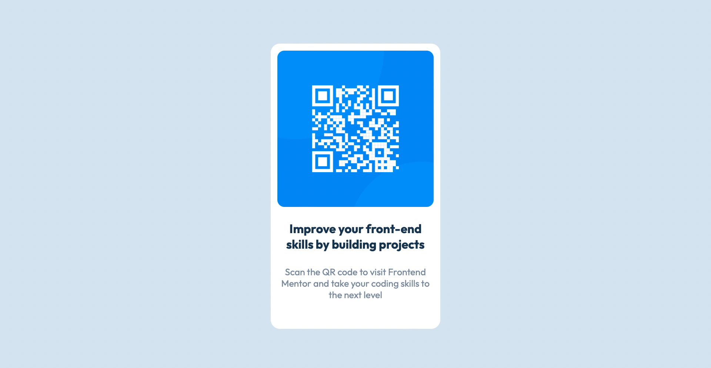

# Frontend Mentor - QR code component solution Matias Frascino

This is a solution to the [QR code component challenge on Frontend Mentor](https://www.frontendmentor.io/challenges/qr-code-component-iux_sIO_H). Frontend Mentor challenges help you improve your coding skills by building realistic projects. 

## Table of contents

- [Overview](#overview)
  - [Screenshot](#screenshot)
  - [Links](#links)
- [My process](#my-process)
  - [Built with](#built-with)
- [Author](#author)

## Overview
This is a project showcasing a responsive card created using flexbox. On the card, there's a QR code that you can scan, which will redirect you to the frontendmentor.io website.

### Screenshot

### Links

- Solution URL: [https://github.com/MatiasFrascino/qr-code-component](https://github.com/MatiasFrascino/qr-code-component)
- Live Site URL: [https://matiasfrascino.github.io/qr-code-component/](https://matiasfrascino.github.io/qr-code-component/)

## My process

### Built with

- Semantic HTML5 markup
- CSS custom properties
- Flexbox
- Mobile-first workflow

## Author

- GitHub - [Matias Frascino](https://github.com/MatiasFrascino)
- Frontend Mentor - [@MatiasFrascino](https://www.frontendmentor.io/profile/MatiasFrascino)
- Linkedin - [Matias Frascino](www.linkedin.com/in/matias-sebastian-frascino-60332316b)
